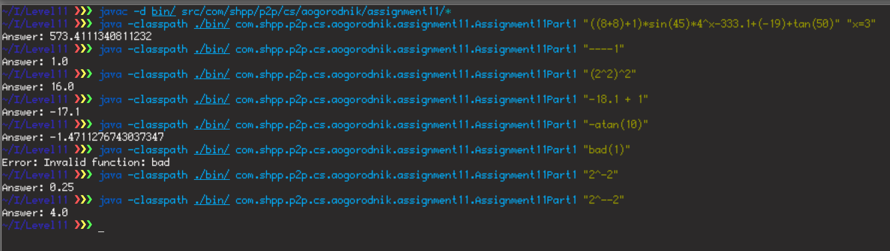
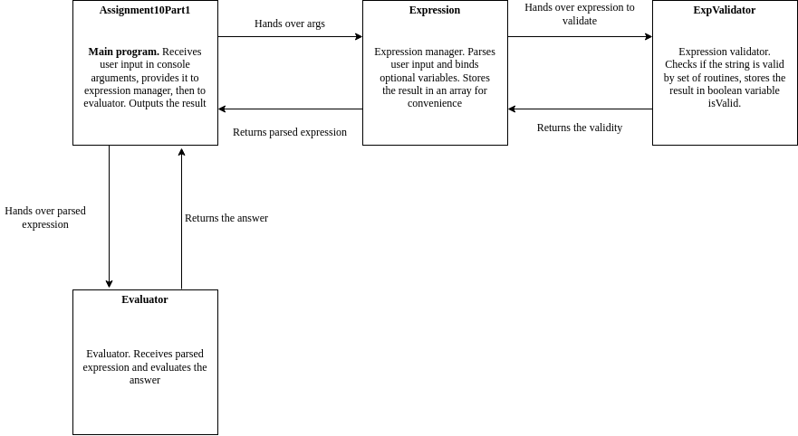

Expression evaluator v2.0\
Supports:

    - +,-,\*,/,^ operations
    - negative numbers and numbers with floating point
    - parentheses ()
    - the following functions: sin, cos, tan, atan, log10, log2, sqrt
    - single-letter variables (x, Y, z, m...)
    - advanced syntax validation

Warning: Requires JDK 12+

# How it works
Example:


# Architecture


The expression is parsed into AST (abstract syntax tree), example:

```
     * "1+(1+3*sin(-x))^7"        * "1-2-3-(4-5)"
     *                 [+]        *              [-]
     *                /  \        *            /    \
     *              [^]  [1]      *         [-]      [-]
     *             /  \           *        /  \     /  \
     *           [+]  [7]         *     [-]  [3]  [4]  [5]
     *          /  \              *    /  \
     *        [*]  [1]            *  [1]  [2]
     *       /  \                 *
     *   [sin]  [3]               *
     *     |                      *
     *    [-x]                    *
     *                            *
```
