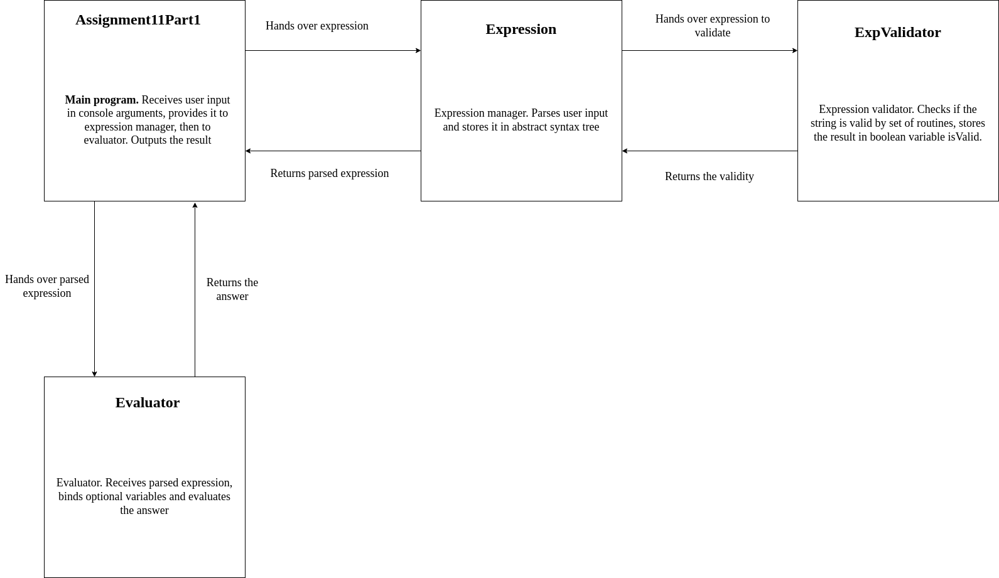

Expression evaluator v2.0

Supports:

    - +,-,\*,/,^ operations
    - negative numbers and numbers with floating point
    - parentheses ()
    - the following functions: sin, cos, tan, atan, log10, log2, sqrt
    - single-letter variables (x, Y, z, m...)
    - advanced syntax validation

# How it works
Example:

# Architecture

The expression is parsed into AST (abstract syntax tree), example:

